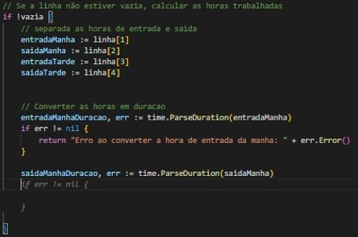
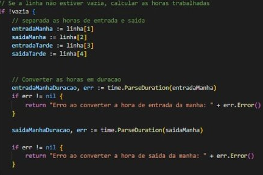
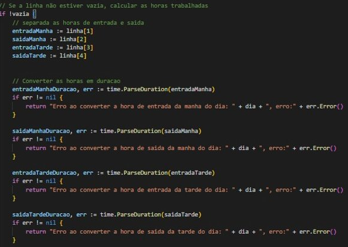

# O Uso da Inteligência Artificial no Desenvolvimento Diário​
## Transformando Desafios em Oportunidades​

### O que é inteligencia artifical?​

Inteligência artificial refere-se à simulação de processos cognitivos humanos por meio de algoritmos computacionais, permitindo que as máquinas aprendam, raciocinem e tomem decisões, amplamente utilizada em diversas aplicações tecnológicas.​

### Como a IA pode ajudar no desenvolvimento?​
​
- Automatizar tarefas repetitivas, como a análise de código e a geração de relatórios.​
- Encontrar bugs e erros no código de forma mais eficiente.​
- Sugerir melhores práticas de código e ajudar a evitar erros comuns.​
- Analisar o desempenho do código e sugerir melhores maneiras de otimizá-lo.
- Criar novas funcionalidades e melhorar a experiência do usuário.

### Cuidados sempre importantes​

- Validação Humana Essencial: A supervisão manual é crucial para garantir a qualidade e relevância das sugestões geradas pelas ferramentas de IA.
- Consciência de Viés: Esteja atento aos possíveis vieses presentes nos dados de treinamento e tome medidas para mitigá-los, especialmente em contextos sensíveis.
- Proteção de Dados: Implemente medidas robustas de segurança para proteger dados sensíveis contra vazamentos ou acessos não autorizados ao utilizar essas ferramentas.
- Entendimento das Limitações: Compreenda as capacidades e limitações das ferramentas para aplicá-las nos cenários apropriados e evitar expectativas irrealistas.
- Compreensão Legal e Ética: Esteja em conformidade com regulamentações de proteção de dados e considere as implicações éticas ao utilizar tecnologias de IA, garantindo práticas legais e éticas em seu uso.

### Ferramentas IA Integrada​

- [Codewhisperer](https://aws.amazon.com/pt/codewhisperer):​ Ferramenta que utiliza IA para auxiliar desenvolvedores a entender e corrigir código automaticamente, proporcionando soluções rápidas e eficientes​
- [GitHub Copilot](https://github.com/features/copilot):​ Ferramenta que usa IA para ajudar na escrita de código, oferecendo sugestões em tempo real, aumentando a produtividade e melhorando a precisão durante o desenvolvimento​
- [Codeium](https://codeium.com):​ Ferramenta que integra IA no processo de desenvolvimento, melhorando a eficiência e qualidade do código ao fornecer análises preditivas, sugestões contextuais e correções automáticas para os desenvolvedores.​

### Ferramentas IA “Orquestradoras”​

- [ChatGPT](https://chat.openai.com) é um chatbot online de inteligência artificial desenvolvido pela OpenAI​
- [Bard](https://bard.google.com) é um chatbot desenvolvido pelo Google, baseado na família de modelos de linguagem LaMDA.

### Integrada​ x “Orquestradoras”​

- IA Integrada: São modelos de inteligência artificial que são incorporados e executados dentro de outros produtos ou ferramentas existentes. Esses modelos são integrados profundamente nos sistemas ou plataformas, proporcionando funcionalidades avançadas, como sugestões de código ou análises automatizadas, diretamente no ambiente de desenvolvimento. Um exemplo disso é a integração de modelos de IA diretamente no Visual Studio Code (VSCode) para oferecer recursos aprimorados aos desenvolvedores durante a codificação.

- IA Orquestradora: São ferramentas ou produtos independentes, desenvolvidos especificamente para realizar a orquestração e coordenação de múltiplos modelos ou recursos de inteligência artificial. Geralmente, essas ferramentas oferecem soluções mais abrangentes e sofisticadas, coordenando a interação de diversos modelos de IA para fornecer resultados mais complexos. Um exemplo é um chatbot autônomo, como o ChatGPT ou o Bard, que são desenvolvidos como entidades independentes capazes de entender e responder a uma ampla variedade de consultas ou interações com base em seus próprios algoritmos e capacidades.

### Em resumo​

A IA transforma o desenvolvimento ao automatizar tarefas, encontrar bugs e otimizar códigos, melhorando a experiência do usuário. Contudo, a supervisão humana é essencial para validar sugestões e evitar vieses. Grandes empresas como Google, Facebook, Tesla, Apple e Microsoft já estão aplicando a IA para aprimorar seus processos de desenvolvimento.​

### Exemplo (Codeium):
- 
- 
- 
- 
- 

