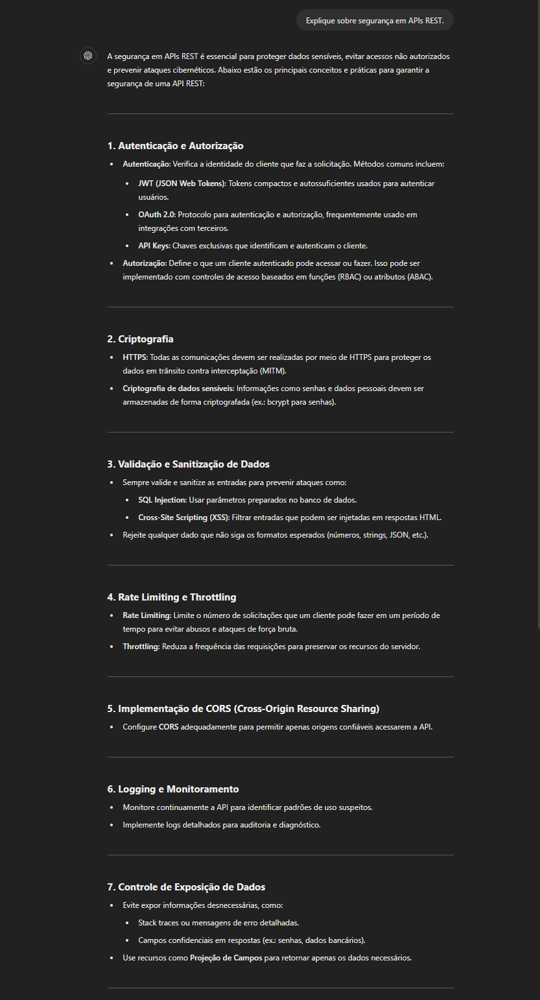
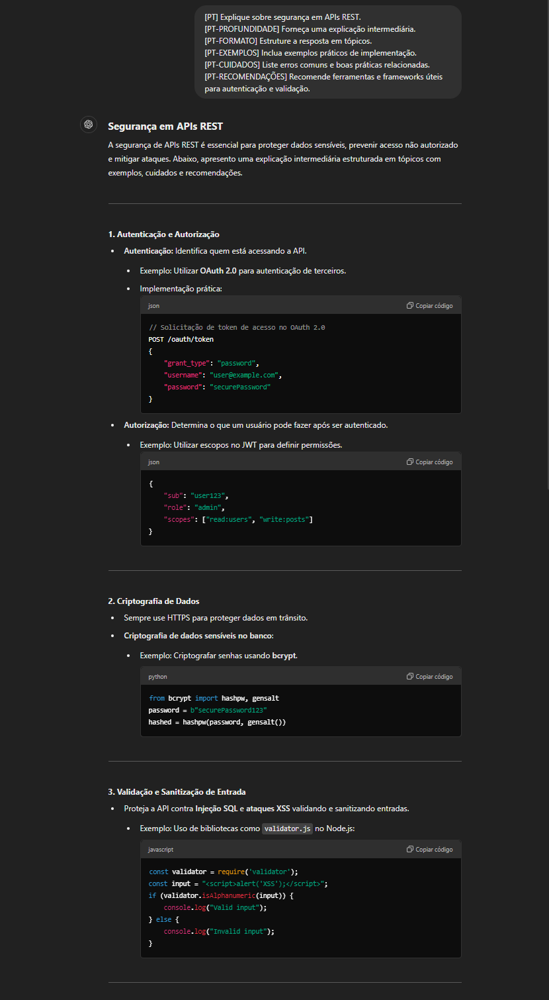

# ✍️🤖 Aprenda a Melhorar Seus Prompts e Obtenha Respostas Mais Detalhadas e Relevantes

Para potencializar uma resposta mais eficaz, podemos adicionar mais itens à estrutura do prompt, os quais orientam a IA a oferecer respostas ricas, detalhadas e no formato esperado.

## Abaixo estão exemplos revisados e aprimorados

### 🌍 Tradução e Idiomas

[PT-TRAD]: Solicitar tradução para português.
[EN-TRAD]: Solicitar tradução para inglês.
[LANG-CHANGE:XX]: Alterar o idioma para o código ISO (Ex.: [LANG-CHANGE:ES] para espanhol).

### 📚 Formato de Resposta

[LIST]: Solicitar resposta em formato de lista.
[TABLE]: Solicitar uma tabela como resposta.
[CODE]: Pedir um exemplo de código.
[EXAMPLE]: Solicitar exemplos claros e objetivos.
[STEP-BY-STEP]: Resposta em passos detalhados.
[SHORT]: Resposta breve e direta.
[LONG]: Resposta mais extensa e detalhada.

### 🗣 Estilo de Comunicação

[FORMAL]: Resposta em tom formal.
[INFORMAL]: Resposta em tom descontraído.
[BEGINNER]: Explicação para iniciantes.
[ADVANCED]: Explicação para usuários avançados.
[ANALOGY]: Usar analogias ou comparações.
[VISUAL]: Sugerir ou incluir uma representação visual (gráficos, diagramas).

### ⚙️ Técnico

[DEBUG]: Ajudar a depurar problemas.
[OPTIMIZE]: Melhorar código ou lógica.
[EXPLAIN]: Explicação técnica detalhada.
[DESIGN]: Fornecer sugestões de design.
[SECURITY]: Focar em práticas de segurança.

### 💡 Consultoria e Melhorias

[FEEDBACK]: Solicitar análise crítica.
[SUGGEST]: Sugestões para melhoria.
[COMPARE]: Comparar alternativas (Ex.: frameworks, métodos).
[BEST-PRACTICES]: Recomendações de melhores práticas.

### 🎨 Criatividade e Escrita

[IDEA]: Pedir ideias ou sugestões criativas.
[PLOT]: Pedir desenvolvimento de enredo (ex.: contos, histórias).
[EDIT]: Solicitar edição ou refinamento de texto.

### 📄 Documentação e Estudos

[DOC]: Gerar documentação técnica.
[CITATION]: Incluir referências ou citações.
[EXPLAIN-CONCEPT]: Explicar conceitos teóricos.
[SIMPLIFY]: Explicação simplificada.

### 🛠 Estudos de Caso

[PT-CASES]: Peça estudos de caso relacionados ao tema, com a resposta em português.
[EN-CASES]: Peça estudos de caso relacionados ao tema, com a resposta em inglês.
[ES-CASES]: Peça estudos de caso relacionados ao tema, com a resposta em espanhol.

### 🔄 Comparações

[PT-COMPARAÇÕES]: Solicite comparações entre abordagens ou ferramentas similares, com a resposta em português.
[EN-COMPARISONS]: Solicite comparações entre abordagens ou ferramentas similares, com a resposta em inglês.
[ES-COMPARACIONES]: Solicite comparações entre abordagens ou ferramentas similares, com a resposta em espanhol.

### 📜 Histórico e Futuro

[PT-HISTÓRICO]: Inclua o contexto histórico ou evolução do tópico, com a resposta em português.
[EN-HISTORICAL]: Inclua o contexto histórico ou evolução do tópico, com a resposta em inglês.
[ES-HISTÓRICO]: Inclua o contexto histórico ou evolução do tópico, com a resposta em espanhol.
[PT-FUTURO]: Pergunte sobre tendências futuras ou inovações relacionadas ao tema, com a resposta em português.
[EN-FUTURE]: Pergunte sobre tendências futuras ou inovações relacionadas ao tema, com a resposta em inglês.
[ES-FUTURO]: Pergunte sobre tendências futuras ou inovações relacionadas ao tema, com a resposta em espanhol.

### ⚠️ Cuidados e Boas Práticas

[PT-CUIDADOS]: Peça orientações sobre boas práticas e erros comuns, com a resposta em português.
[EN-CAUTIONS]: Peça orientações sobre boas práticas e erros comuns, com a resposta em inglês.
[ES-CUIDADOS]: Peça orientações sobre boas práticas e erros comuns, com a resposta em espanhol.
[PT-BOAS-PRÁTICAS]: Solicite informações sobre boas práticas e recomendações, com a resposta em português.

### 📌 Exemplo Prompt Simples (Sem Potencializadores)

```plaintext
Explique sobre segurança em APIs REST.
```

Resultado:




### 🌟 Exemplo Prompt Avançado (Com Potencializadores)

```plaintext
[PT] Explique sobre segurança em APIs REST.
[PT-PROFUNDIDADE] Forneça uma explicação intermediária.
[PT-FORMATO] Estruture a resposta em tópicos.
[PT-EXEMPLOS] Inclua exemplos práticos de implementação.
[PT-CUIDADOS] Liste erros comuns e boas práticas relacionadas.
[PT-RECOMENDAÇÕES] Recomende ferramentas e frameworks úteis para autenticação e validação.
[PT-TRAD] Traduza a resposta para inglês e espanhol.
```

Resultado:




## ⚠️ Disclaimer

Embora as melhorias nos prompts aprimorem a qualidade das respostas, toda informação gerada pela IA deve ser avaliada criticamente e validada para garantir precisão. Sempre revise, teste e confirme as informações antes de aplicá-las.
